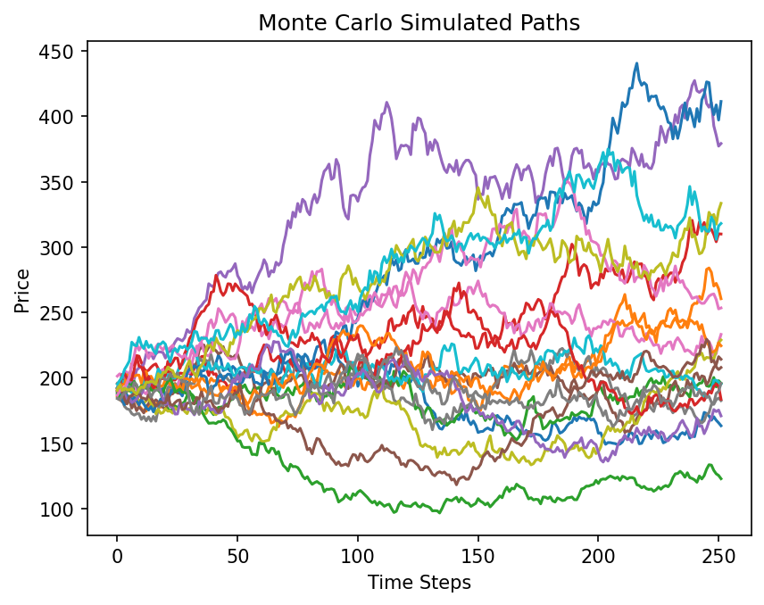
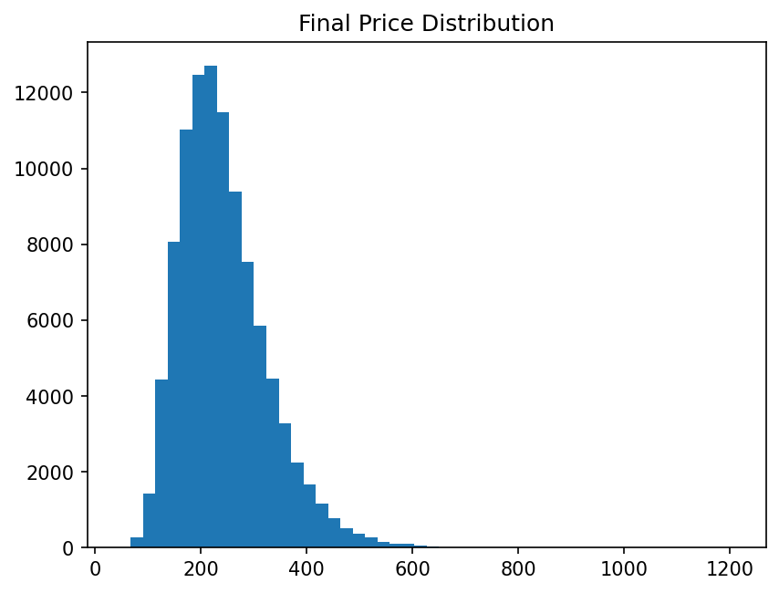
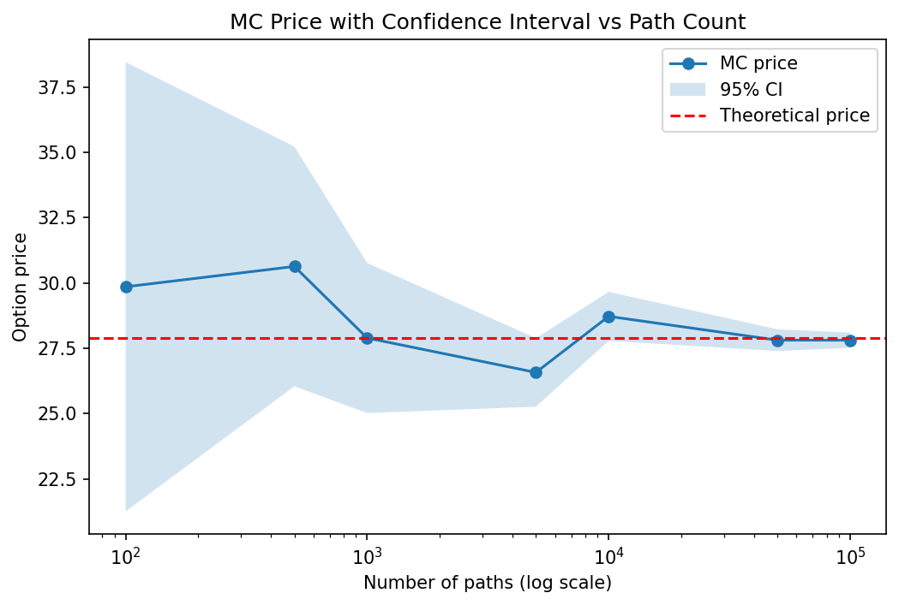
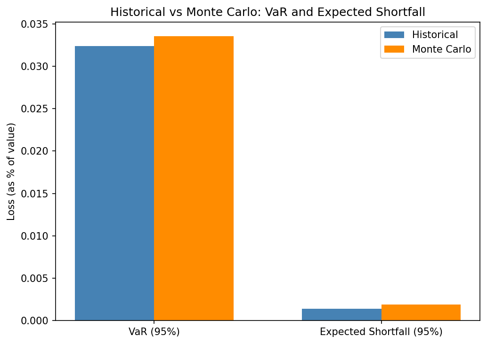
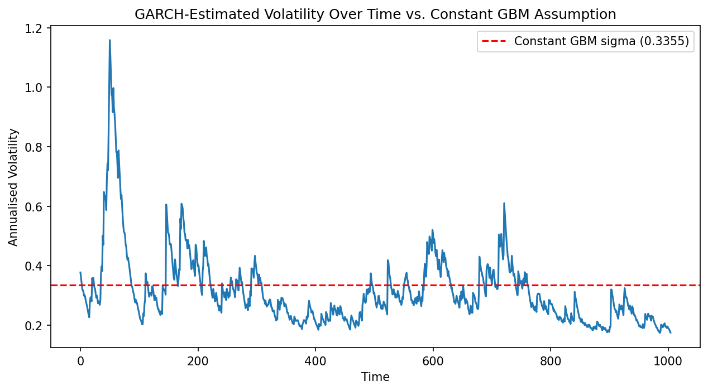

# Monte Carlo Simulation Engine for Option Pricing & Risk Analysis

## Introduction

A python-based Monte Carlo framwork that uses AAPL's historical stock price data then prices a European call option, validates the data, and estimates risk with VaR/Expected Shortfall using the simulation and historical returns.

## Overview

Uses AAPL(2020-2024) data and uses Geometric Brownian Motion to simulate how the stock moves. Then uses the Monte Carlo simulation to estimate the price of an European call on AAPL today and is checked against the exact Black-Scholes formula to confirm whether it is correct. It also returns VaR and Expected Shortfall to check how much an investor could lose. I have also added a GARCH(1,1) model that helps to include time-varying volatility using real historical returns and compares this to the use of constant volatility to see how results differ.

## Explanation of the Whole Project

### GBM (Geometric Brownian Motion)

The stock's future price is random so we use the Geometric Brownian Model, which uses the average rate of growth (drift) and its volatility. GBM:

dS_t = μ S_t dt + σ S_t dW_t

This means that the model of the change in price depends on drift and a random shock component multiplied by volatility.

### The Parameters (parameters.py)

I estimated the drift and volatility from historical AAPL prices.

```python
def parameter_estimator(prices):
    returns = np.log(prices/prices.shift(1)).dropna()
    mu = returns.mean() * 252
    sigma = returns.std() * np.sqrt(252)
    return mu, sigma
```
I then took daily log returns and scaled them by 252 (number of trading days in a year) to annualise them (mu). The mu is the AAPL's estimated growth rate and sigma the estimated volatility.

### Generating randomness (generating_shock.py)

The randomness is generated from the standard normal distributuon (mean of 0 and standard deviation of 1), one path per time time step. I also used antithetic variates, where for each value returned it also returns the negative value, to reduce the variance and noise in the final average.

# Price Paths

```python
def simulate_gbm(S0, mu, sigma, T, dt, Z):
    drift = (mu - 0.5 * sigma**2) * dt
    shock = sigma * np.sqrt(dt) * Z
    log_returns = drift + shock
    price_paths = S0 * np.exp(np.cumsum(log_returns, axis=0))
    return price_paths
```
Each value of random shock generated becomes one simulated price path for the stock. This acts an the engine of the whole project.

When simulating realistic future price behaviour we use mu as we want to reflect what the stock could realistically do, however, when pricing an option it is called with r (the risk-free rate) as the option pricing theory requires a risk-neutral assumption for the resulting price to be theoretically valid.

### Validation - Theortical Mean (validation.py)

GBM has a known formula for the expected (average) price at time T:

```python
def theoretical_mean(S0, mu, T):
    return S0 * np.exp(mu * T)
```
This means that if the stock grows at rate mu, it's average price after time T should be S0 * e^(mu*T). We then compare this with the simulated mean:

```python
print("Validation:")
print(f"Theoretical Mean: {theoretical}")
print(f"Simulated Mean: {simulated}")
```
If the numbers are similar this means that the simulation engine is working as it should.

6. Pricing the option- discounted_payoff.py adn option_pricing.py
An option's payoff only depends on the price at expiry (path[-1], which is the final simulated price on each path). For a call option:

```python
payoff = np.maximum(paths[-1] - K, 0)
```
You make profit if the price ends up above the strike K; otherwise the payoff is zero as you would not execute the option. Since this payoff occurs in the future it needs to be discounted to today's value.

```python
discounted_payoff = np.exp(-r * T) * payoff
```
np.exp(-r * T) is the discount factor and helps to shrink the future value down to the present value and averaging this discounted payoff across all simulated paths gives the Monte Carlo estimate of the option's fair price today.

7. Checking the option price is correct- black_scholes_call.py
A European call option also has an exact, closed-form solution (the Black-Scholes formula) which it can be compared to:

```python
def black_scholes_call(S0, K, r, sigma, T):
    d1 = (np.log(S0/K) + (r + 0.5*sigma**2)*T) / (sigma*np.sqrt(T))
    d2 = d1 - sigma*np.sqrt(T)
    price = S0*norm.cdf(d1) - K*np.exp(-r*T)*norm.cdf(d2)
    return price
```
Comparing the Monte Carlo price against this exact formula, and watching whether these two values converge as the number of paths increases, is the strongest evidence that both the simulation engine and the option pricing logic are working as they should.

### Confidence Intervals (confidence_interval.py)
Every Monte Carlo simulation involves random shocks, so each price estimate has some uncertainty. So we can use confidence intervals to quanitfy how confident we are that the price lies in a range.

```python
def confidence_interval(values, alpha=0.05):
    num = len(values)
    sd = np.std(values,ddof=1)
    mean = np.mean(values)
    z = norm.ppf(1-(alpha/2))
    confidence_interval_upper = mean + (z * sd/np.sqrt(num))
    confidence_interval_lower = mean - (z * sd/np.sqrt(num))
    return mean, (confidence_interval_lower, confidence_interval_upper)
```
This takes any array of simulated values and returns the mean and its confidence bounds. As the number of paths of increases, the interval narrows leading to a more reliable estimate

### Meauring Risk (simulated_var_es.py and historical_var_es.py)

This answers the question of how much would an investor lose if they invested in the stock.

- Value at Risk(VaR): the loss threshold you should not expect to exceed most of the time (e.g. 95% of the time)
- Expected shortfall(ES): if a loss does exceed VaR, what is the average loss in those worst-case scenarios? ES captures tail risk that VaR alone can miss.
This is computed in two ways:
From the simulation:

```python
def compute_var_es(final_prices, S0, alpha=5):
    returns = (final_prices - S0) / S0
    value_at_risk = -np.percentile(returns, alpha)
    expected_shortfall = -returns[returns <= value_at_risk].mean()
    return value_at_risk, expected_shortfall
```

And from real historical AAPL returns:

```python
def compute_historical_var_es(historical_returns, alpha=5):
    value_at_risk = -np.percentile(historical_returns, alpha)
    expected_shortfall = -historical_returns[historical_returns <= value_at_risk].mean()
    return value_at_risk, expected_shortfall
```

If the historical and Monte Carlo VaR/ES values land close together, it's evidence that the GBM model's assumptions (constant volatility, normally distributed daily returns) are a reasonable approximation of how AAPL actually behaves.

### Testing the constant-volatility assumption (fit_garch.py , compute_annualised_volatility.py , forecast_volatility.py)

Every calculation takes sigma as being a constant value, while in reality, volatility clusters. Where there are big price movements there are usually more big price movements that follow and this is the same with calmer periods that tend to stay calm. A GARCH(1,1) model is fit to the same historical returns to estimate how volatility actually varies day-to-day, rather than assuming it is constant.

```python
def fit_garch(historical_returns):
    returns_pct = historical_returns * 100
    model = arch_model(returns_pct, vol='Garch', p=1, q=1, mean='Constant', dist='normal')
    fitted = model.fit(disp='off')
    return fitted
```

GARCH uses yesterday's volatility and the size of yesterday's price shock to find an estimate for today's volatility, where compute_annualised_volatility then annualises this volatility. The forecast_volatility function helps to project what the volatility will be like over the next horizon days and gradually reverts to a long-run average the further out it projects. This is then all taken and plotted against the constant sigma and shows exactly how much the constant-volatility assumption misses - see the GARCH volatility plot in Validation & Results.

## Project Structure

monte-carlo-simulation/
├── src/
│   ├── parameters.py
│   ├── generating_shock.py
│   ├── simulation_engine.py
│   ├── discounted_payoff.py
│   ├── option_pricing.py
│   ├── black_scholes_call.py
│   ├── confidence_interval.py
│   ├── validation.py
│   ├── compute_delta.py
│   ├── black_scholes_delta.py
│   ├── simulated_var_es.py
│   ├── historical_var_es.py
│   ├── fit_garch.py
│   ├── compute_annualised_volatility.py
│   └── forecast_volatility.py
├── outputs/
│   ├── price_paths.png
│   ├── final_price_distribution.png
│   ├── convergence_plot.png
│   ├── var_comparison.png
│   └── garch_volatility.png
├── main.py
├── requirements.txt
├── .gitignore
└── README.md

## Features

### Parameter Estimation (parameters.py)

- Estimates annualised drift (mu) and volatility (sigma) from real historical AAPL price data

### Simulation Engine (generating_shock.py, simulation_engine.py)

- Random shock generation with antithetic variates (variance reduction)
- GBM-based path simulation

### Option Pricing (discounted_payoff.py, option_pricing.py, black_scholes_call.py)

- Monte Carlo pricing of a European call option
- Closed-form Black-Scholes price for direct comparison
- Delta (price sensitivity to the underlying) via finite-difference (bump-and-revalue) simulation

### Validation (validation.py, confidence_interval.py)

- Theoretical_mean: checks the simulation engine's statistical behaviour, independent of option pricing
- Confidence intervals on the Monte Carlo price estimate
- Convergence plot: MC price (with shaded 95% CI) vs. number of simulated paths, benchmarked against the theoretical Black-Scholes price

### Risk Metrics (simulated_var_es.py, historical_var_es.py)

- Monte Carlo VaR and Expected Shortfall (1-day horizon, from simulation)
- Historical VaR and Expected Shortfall (1-day horizon, from real AAPL returns)
- Bar chart comparing both, at matching time horizons

### Volatility Extension (fit_garch.py, compute_annualised_volatility.py, forecast_volatility.py)

- GARCH(1,1) model fit to historical returns, estimating day-by-day volatility instead of assuming it's constant
- 10-day forward volatility forecast
- Direct comparison against the GBM model's constant sigma, comparing how much they differ and the downsides of using constant volatility

### Visualisations

- Simulated price paths over the option's 1-year horizon
- Histogram of final simulated prices (lognormal distribution)
- Convergence plot with shrinking confidence interval band
- Historical vs. Monte Carlo VaR/ES comparison bar chart
- GARCH-estimated volatility over time vs. the constant GBM assumption

## Mathematical Background

### Asset price process (Geometric Brownian Motion):

dS_t = μ S_t dt + σ S_t dW_t

Discrete-time simulation formula (log-price):

### log(S_t) = log(S_0) + (μ - 0.5σ²)t + σ√t · Z,   Z ~ N(0,1)

### Option price (risk-neutral discounted expectation):

Price = e^(-rT) · E[max(S_T - K, 0)]

### Expected price under GBM (used for engine validation):

E[S_T] = S0 · e^(μT)

### Confidence interval on a Monte Carlo estimate:

CI = mean ± z · (std / √n)

### Delta (price sensitivity to the underlying), via finite difference:

Delta ≈ [Price(S0(1+ε)) - Price(S0(1-ε))] / (2 · S0 · ε)

## Example Output

Paramters:
S0: 190.3750762939453, mu: 0.24264807268506247, sigma: 0.3355335649137946
Monte Carlo VaR (95%): 0.0335, ES: 0.0421
Historical VaR (95%):  0.0324, ES: 0.0469
Validation:
Theoretical Mean: 242.6558743376862
Simulated Mean: 242.79241004040927
Option Pricing:
Monte Carlo Call Price: 28.096410887608847
Theoretical (Black-Scholes) Call Price: 27.9016
Difference: 0.1948
Discounted Payoffs: [  0.          19.65415874   0.          58.49227184 112.78755688
   0.           0.           0.           0.           0.        ]
Confidence Interval:
95% Confidence Interval:[27.8001, 28.3928]
Monte Carlo Delta: 0.6040
Theoretical Delta: 0.6015
GARCH Volatility Analysis:
GBM constant sigma: 0.3355
GARCH volatility range: 0.1744 to 1.1583
GARCH 10-day forward forecast: [0.17557774 0.18087852 0.18591625 0.19071418 0.1952923  0.19966792
 0.2038562  0.20787049 0.21172261 0.21542315]

## Installation
```bash
git clone <your-repo-url>
cd monte-carlo-simulation
pip install -r requirements.txt
```
Requirements: numpy, scipy, matplotlib, pandas, yfinance

## Usage
```bash
python main.py
```
This downloads AAPL historical data, estimates model parameters, runs the Monte Carlo simulation, prices the option, computes risk metrics, and displays all four plots described below.

## Validation & Results

1. 
Simulated price paths — 20 sample paths shown over the option's 1-year horizon, starting from AAPL's actual last price. Paths fan out over time as uncertainty compounds as you look further into the future.

2. 
Final price distribution — a histogram of all simulated final prices, correctly right-skewed (lognormal), never going negative, as a stock price cannot become negative — the expected shape under GBM.

3. 
Convergence plot — Monte Carlo option price plotted against number of simulated paths with a shaded 95% CI band, benchmarked against the theoretical Black-Scholes price. The Monte Carlo price converges onto the theoretical price by ~5,000-10,000 paths, and the CI band visibly narrows as paths increase, which is direct evidence the pricing pipeline is correct.

4. 
Historical vs. Monte Carlo VaR/ES, where it shows a bar chart comparing both metrics at a matching 1-day horizon. Historical (~3.2% VaR) and Monte Carlo (~3.4% VaR) land close together, with Monte Carlo slightly higher which indicates that the GBM model's risk estimate is a reasonable and also acts as an approximation of AAPL's real historical risk.

5. 
A GARCH(1, 1) model fit to the same historical returns and it shows that volatility ranged from 17.4% to 115.8% over the sample period, compared to the 33.6% figure assumed throughout the GBM simulation. The sharp early spike corresponds to the March 2020 market crash and several smaller spikes indicates market stress, with volatility settling into a calmer state later in the sample. This, therefore, shows that the constant sigma fails to capture any of this variation, which is evidence of its limitation. Also shows how over the 10-day forecast the values increase from 17.6% to 21.5% reflecting a return toward typical volatility levels from the currently calmer regime.

## Lessons Learned (bugs found and fixed during development)

- Drift confusion (mu vs r): early versions I had accidentally mixed up the real-world drift (mu) and the risk-free rate (r). Simulating realistic price behavior requires mu; pricing an option requires r for the result to be theoretically valid. Using the wrong one in either place causes systematic mispricing.
- Hardcoded comparison parameters: the theoretical price was initially computed with hardcoded placeholder values (S0=100, K=100, sigma=0.2) instead of the actual estimated parameters which makes the convergence plot's benchmark line meaningless. Fixed by passing the same real S0, K, r, sigma into both the Monte Carlo and Black-Scholes calculations.
- Time horizon mismatch in VaR comparison: historical returns are daily, but the first Monte Carlo VaR used a full year of simulated growth and comparing a 1-day risk figure against a 1-year one produced majorly different results. Fixed by running a separate, short 1-day simulation specifically for the VaR comparison and was kept independent from the 1-year simulation used for option pricing.